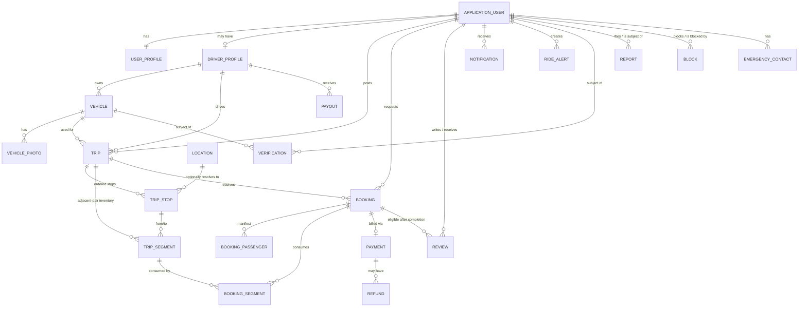

# Database Schema

PostgreSQL 16. All tables use `uuid` primary keys, `timestamptz` for all timestamps (stored UTC, converted at the edges), `decimal(18,2)` for money. Naming: `snake_case` tables/columns (EF Core's default Npgsql convention via `UseSnakeCaseNamingConvention` or explicit configuration), PascalCase in C#.

Every entity's `Id` is explicitly configured `ValueGenerated.Never` (set once, model-wide, in `AppDbContext.OnModelCreating` — not per-entity) since every key is client-generated (`Guid.CreateVersion7()`, see `Entity`). This isn't just documentation: without it, EF Core's Added-vs-Unchanged heuristic for an entity discovered via a collection navigation rather than an explicit `Add()` call (e.g. a new `VehiclePhoto` reached through `Vehicle.Photos`) assumes a non-default key means "already exists" and silently issues an `UPDATE` for a row that was never inserted — a real bug this project hit and fixed in Phase 3 (see `Vehicle`/`VehiclePhoto`).

This document describes the schema conceptually; the EF Core migrations in `backend/src/Hika.Infrastructure/Migrations` are the authoritative source once Phase 2+ lands.

## Entity-relationship diagram (core domain)

*(Diagram covers the core relationships; `AuditLog` intentionally omitted since it references arbitrary entity types generically.)*

## Table notes

### `users` / `user_profiles`
- `users` is ASP.NET Core Identity's table (`AspNetUsers`, customized to `Guid` key) — email (unique index, case-insensitive), normalized email, password hash, security stamp, lockout fields.
- `user_profiles.user_id` is both PK and FK (1:1 via shared primary key — avoids a redundant identity column and makes the 1:1 relationship structurally enforced).
- Index: `user_profiles(phone_number)` unique, nullable-safe (partial index `WHERE phone_number IS NOT NULL`) since phone is verified separately from registration and may briefly be unset.

### `refresh_tokens`
- Index: `(user_id, revoked_at_utc)` to efficiently find a user's active tokens (e.g. "log out all devices").
- `token_hash` unique index — tokens are looked up by hash of the presented value, never by raw value.

### `driver_profiles` / `vehicles` / `vehicle_photos`
- `driver_profiles.user_id` unique FK (1:1, but optional — not every user is a driver).
- `vehicles.driver_profile_id` FK, index for "list my vehicles".
- `vehicle_photos.vehicle_id` FK with cascade delete (photos have no independent lifecycle).

### `trips` / `trip_stops` / `trip_segments`
- `trips`: FK `driver_profile_id`, `vehicle_id`; index on `(status, departure_date_utc)` for search; check constraint `total_seats_offered > 0`.
- `trip_stops`: unique constraint `(trip_id, sequence)`; FK `location_id` nullable.
- `trip_segments`: FK `trip_id`, `from_stop_id`, `to_stop_id`; unique constraint `(trip_id, from_stop_id, to_stop_id)`; check constraint `seats_available >= 0`. Index `(trip_id)` — segments for a trip are always loaded together.
- **Search index**: composite index on `trip_stops(location_id, trip_id)` (and a trigram/`pg_trgm` index on `trip_stops(raw_name)` for free-text town search, since not every stop resolves to a seeded `Location`) supports "find trips passing through X".

### `bookings` / `booking_passengers` / `booking_segments`
- `bookings`: FK `trip_id`, `passenger_user_id`, `boarding_stop_id`, `alighting_stop_id`; index `(trip_id, status)`.
- `booking_segments`: FK `booking_id`, `trip_segment_id`; composite unique `(booking_id, trip_segment_id)`. This table is what makes "how many seats are free on segment S3" a simple `SUM`/counter read rather than a range-overlap computation at query time.
- `booking_passengers`: FK `booking_id`, cascade delete with the booking.

### `payments` / `payouts` / `refunds`
- `payments.booking_id` unique FK (one payment per booking in MVP — a booking that's modified in price would create a new payment attempt rather than mutate a historical one).
- All money columns: `amount numeric(18,2) NOT NULL`, `currency varchar(3) NOT NULL DEFAULT 'ZAR'`.
- `payouts.driver_profile_id` FK, index `(driver_profile_id, status)`.

### `reviews`
- Unique constraint `(booking_id, reviewer_user_id)`.
- Check constraint `rating BETWEEN 1 AND 5`.
- Index `(reviewee_user_id)` for computing/displaying a user's review list and average.

### `notifications` / `ride_alerts`
- `notifications`: index `(user_id, status)` and `(user_id, created_at_utc DESC)` for the in-app feed; `payload` is `jsonb`.
- `ride_alerts`: index `(status, travel_date)` for the matching job to scan efficiently.

### `verifications` / `reports` / `blocks` / `emergency_contacts`
- `verifications`: index `(subject_type, subject_id, type)`; index `(status)` for the admin review queue.
- `blocks`: composite unique `(blocker_user_id, blocked_user_id)`.

### `audit_logs`
- Append-only (no update/delete in normal operation); index `(entity_type, entity_id)` and `(created_at_utc DESC)`. `changes_json` is `jsonb`.

## Concurrency control

- **Seat inventory** (`trip_segments.seats_available`): protected by a Postgres advisory lock scoped to `trip_id` during the booking transaction — see `domain-model.md` §4.3. This is the one place true write concurrency matters at MVP scale.
- **Everything else** (profile edits, trip edits, admin actions): EF Core optimistic concurrency via a `xmin`-based (or explicit `rowversion`/`concurrency_token`) column on entities where a lost-update matters (e.g. `Trip`, `Booking`, `Verification`) — a `DbUpdateConcurrencyException` surfaces as a 409 Conflict, asking the client to reload and retry. Not applied blanket-wide (e.g. `Notification.ReadAtUtc` doesn't need it) — only where two concurrent writers plausibly disagree about intent.

## Migrations

EF Core Code-First migrations, one per schema-affecting phase (e.g. `20260101_InitialUsersAuth`, `20260115_DriversAndVehicles`, ...) rather than one giant migration, so history stays reviewable and reversible. Applied via `dotnet ef database update` in local dev and via a startup migration step (`db.Database.MigrateAsync()`, gated behind an explicit config flag so it never runs unintentionally against production) in containers for now; a dedicated migration-runner step is the natural upgrade once there's a real deployment pipeline.
